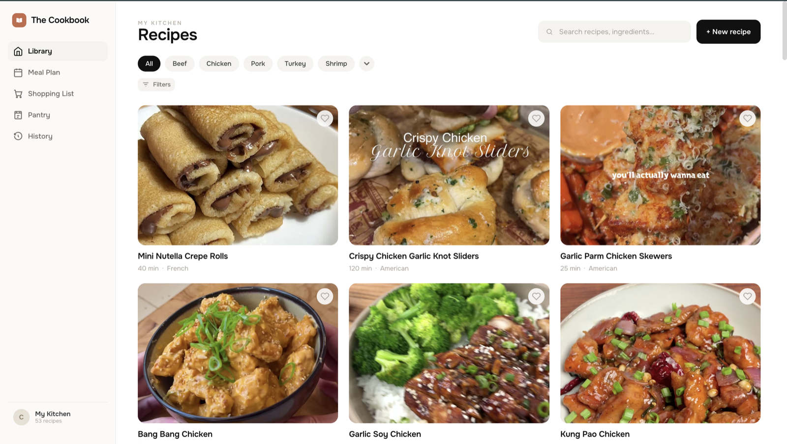
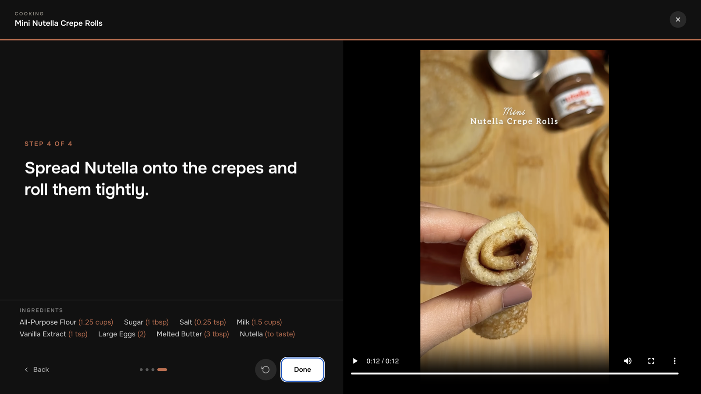

# Cookbook

A personal recipe app that turns Instagram Reels and TikTok cooking videos into structured,
editable recipes. Paste a link (or upload the video), and Google Gemini watches it and returns a
recipe with ingredients, steps, timings, and a cover frame, converted to imperial units.

Around that sits the rest of a kitchen: a searchable recipe library, a monthly meal plan, a
shopping list with price estimates, a pantry you can stock by photographing a receipt, a cooking
log, and a full-screen Cooking Mode that plays the source video beside each step and jumps to the
moment that step happens.

It's an installable PWA built for one person. It runs on a home Mac, and my phone reaches it over
Tailscale.

### The library



These recipes were imported from cooking videos. The cover photos are frames taken from the videos,
which is why some still show the creator's title text. Each card shows total time and
cuisine. You can search by title or ingredient, filter with the protein chips across the top or the
fuller Filters panel, and heart a recipe to favorite it.

### Cooking Mode



Cooking Mode is a full-screen, one-step-at-a-time view. The current step is in large type you can
read from across the kitchen, and the ingredient list with imperial amounts stays pinned underneath.
When a recipe came from a video, the video plays alongside and jumps to the moment each step
happens, using timestamps Gemini returned during import. The rewind button replays the current
step's part of the video.

## Quick start

You need **Node 20+**, **yt-dlp**, and **ffmpeg**, plus a free
[Gemini API key](https://aistudio.google.com/apikey).

```bash
brew install yt-dlp ffmpeg          # Linux: pip install yt-dlp, and ffmpeg from your package manager

git clone https://github.com/carsongranese3/Cookbook.git
cd Cookbook

cp server/.env.example server/.env  # then set GEMINI_API_KEY in server/.env

cd server && npm install && npm run dev     # API on http://localhost:3001
cd client && npm install && npm run dev     # app on http://localhost:5173 (second terminal)
```

Open http://localhost:5173. The Vite dev server proxies `/api/*` to the API.

For everyday use, build the client once (`cd client && npm run build`) and use
http://localhost:3001 instead. The API serves `client/dist` itself, so one process serves
everything.

### Configuration (`server/.env`)

| Variable | Required | What it does |
| --- | --- | --- |
| `GEMINI_API_KEY` | yes | Gemini key for video import, receipt scanning, and price estimates. Server-side only. |
| `PORT` | no | API port. Default `3001`. |
| `YTDLP_COOKIES` | for Instagram | Absolute path to a Netscape-format cookies file from a logged-in browser. It must include the HttpOnly `sessionid` cookie. TikTok usually works without one. |
| `GEMINI_MODEL` | no | Primary model. Default `gemini-3.1-flash-lite`. |
| `GEMINI_MODELS` | no | Comma-separated list that replaces the whole fallback chain. |
| `GEMINI_TIMEOUT_MS` | no | Per-call timeout. Default `120000`. |

Link import is the fragile part. Uploading the video file always works and doesn't need yt-dlp.

## Engineering notes

**One Gemini call per import.** The video and its caption go to Gemini in a single request, and
everything comes back from it: the recipe, metric-to-imperial conversion, category labels, and a
timestamp for each step (which is what lets Cooking Mode seek the video). The cover photo is a frame
grabbed locally with ffmpeg, not a second AI call. The only extra call is one retry when the model
returns JSON that won't parse. This keeps a whole library inside the free tier.

**Free-tier model fallback.** Each free-tier Gemini model has its own daily quota. On a 429 or 503
the server moves to the next model in the chain (`server/extract/gemini.js`) before giving up, so
a busy model doesn't stop an import.

**Price precedence: manual → receipt → AI → unpriced.** Shopping-list prices come from three
sources, and the first one that has a price wins. A price you typed is an explicit fact. A price
from a scanned receipt is what you actually paid, scaled to the quantity on the list (1.87 lb for
$8.41 means 1.5 lb shows $6.75). An AI estimate is a guess and is labeled as one. Receipts live in
an append-only observation table, separate from the overwritable AI price cache, so a cache write
can never overwrite real data. Items that already have a receipt price are left out of the Gemini
batch entirely, so estimating gets cheaper the more you shop. Nothing calls Gemini until you press
Estimate.

**Typed error codes.** Every failure in the extraction layer is an `ExtractError` with a
machine-readable code and a user-facing message (`server/extract/errors.js`). yt-dlp's stderr is
classified into specific causes (`COOKIES_EXPIRED`, `PRIVATE_POST`, `SOURCE_RATE_LIMITED`,
`GEO_OR_IP_BLOCKED`, `NO_VIDEO_IN_POST`, …) instead of one "couldn't fetch" message, so the UI can
tell you what to fix. Instagram rate-limiting the download (`SOURCE_RATE_LIMITED`) and Gemini's
own quota (`RATE_LIMITED`) are deliberately separate codes.

**Single-user over Tailscale, by design.** There is no login. The app runs on a home machine and
is reachable only from devices on my private Tailscale network, so the network is the access
control. Running downloads from a residential IP also makes yt-dlp far more reliable than a cloud
server would be. If you expose this to the public internet, you're exposing an unauthenticated app
that holds a Gemini key, so don't.

## Running it always-on (macOS)

[`deploy/`](./deploy) has two LaunchAgents: `com.cookbook.server` keeps the API and built app
running on :3001, and `com.cookbook.build` runs `vite build --watch` so :3001 always serves the
current UI. Install them with `cp deploy/*.plist ~/Library/LaunchAgents/` and `launchctl load` on
each, after editing the paths inside to match your checkout.

- After server changes: `cd server && npm run service:restart` (also `service:stop`,
  `service:start`, `service:log`).
- After editing a `.plist`: `launchctl unload` then `launchctl load` it. `service:restart` reuses
  the already-loaded definition.
- From a phone: install [Tailscale](https://tailscale.com) on both devices and open
  `http://<your-machine>.<your-tailnet>.ts.net:3001`. The Vite dev server on :5173 is
  localhost-only.

## Repository layout

- `server/`: Express API on SQLite (`better-sqlite3`). Holds the Gemini key and runs yt-dlp and
  ffmpeg.
  - `server/extract/`: the AI layer (video import, receipt scanning, price estimates).
- `client/`: React + Vite PWA, plain hand-written CSS.
- `docs/`: [API contract](./docs/api.md), [data shapes](./docs/data-shapes.md),
  [design mapping](./docs/design.md), and the [decisions log](./docs/decisions.md), which records
  why things are the way they are.
- `specs/`: feature specs. `design/`: the original design prototype, code-named "Pantry".

## How this was built

I designed the app and made the calls: Gemini's free tier for extraction, a home Mac on Tailscale
instead of a hosted server with logins, one Gemini call per import, and the price-precedence rules.
Those decisions are recorded with their reasoning in [`docs/decisions.md`](docs/decisions.md), and
the plan the first version started from is in
[`docs/original-build-plan.md`](docs/original-build-plan.md).

The implementation was built with Claude Code, using a team of specialist agents (requirements,
exploration, data, backend, frontend, QA and DevOps) coordinated through [`CLAUDE.md`](CLAUDE.md).
The look started as a prototype in Claude Design, saved in `design/`, and was rebuilt in the app's
own hand-written CSS.

## Personal use

This is a personal project. Downloading videos from Instagram or TikTok may violate their Terms of
Service. Only import content you have the right to use, keep the results for your own cooking,
and credit the creators. Every imported recipe keeps its source link and caption for that reason.
Nothing here redistributes or republishes videos. They're stored locally on your own machine.
